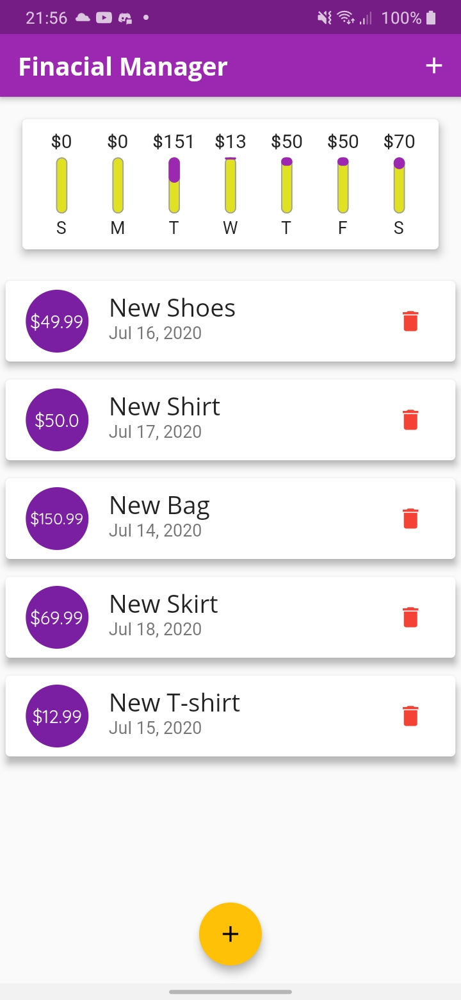
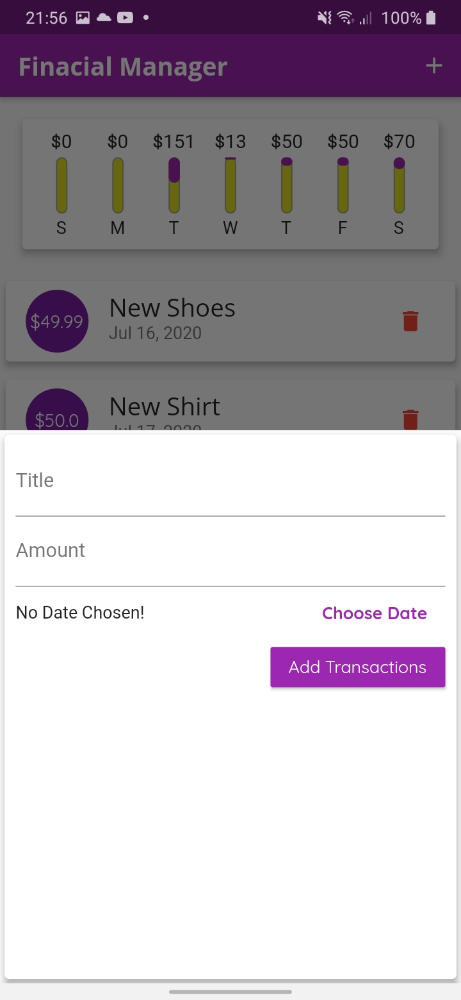
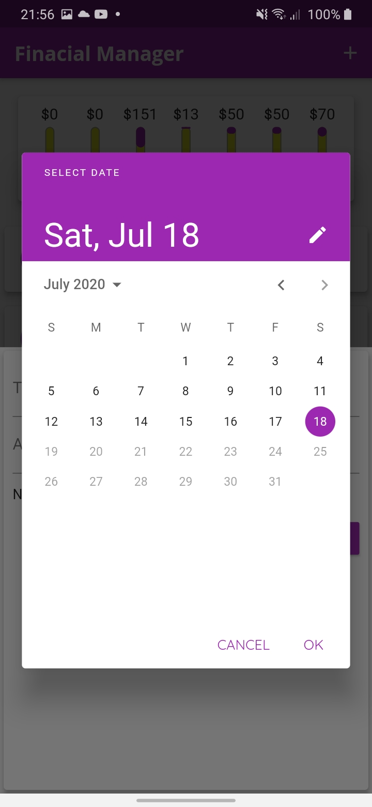
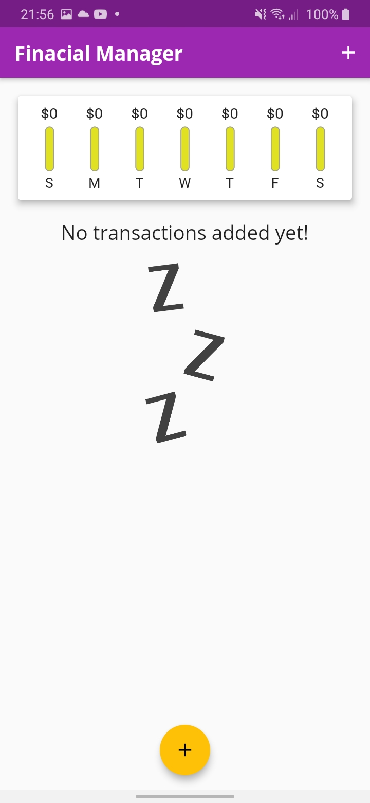

<h2 align="center"> 
  Finacial Manager - Flutter :blue_heart:
</h1>

<p align="center">
  <a href="https://www.linkedin.com/in/frank-laercio/">
    
  </a>
  
  
  
  <a href="https://github.com/franklaercio/financial-manager-flutter/commits/master">
    
  </a>
  
  

  
   <a href="https://github.com/franklaercio/financial-manager-flutterr/stargazers">
    
  </a>
</p>

# :moneybag: Finacial Manager

This is an app for finances manager your personal. In this app it's possible add your spending by date, remove spending and to view a chart with spending in the last week.

<p>
     
</p>

## :mag_right: Getting Started

For started you need install [Flutter](https://flutter.dev/docs/get-started/install)

### :hammer: Installing

Befere download app and install Flutter, you need connect one mobile device and execute these commands in your terminal:

```flutter pub get``` <br /><br />
```flutter run```

## :family: Contributing

Please read [CONTRIBUTING.md](https://gist.github.com/PurpleBooth/b24679402957c63ec426) for details on our code of conduct, and the process for submitting pull requests to us.

## :chart_with_upwards_trend: Versioning

For the versions available, see the [tags on this repository](https://github.com/franklaercio/financial-manager-flutter/tags). 

## :man_technologist: Authors

* **Frank Laércio** - [franklaercio](https://github.com/franklaercio)

See also the list of [contributors](https://github.com/franklaercio/financial-manager-flutter/contributors) who participated in this project.

## :clipboard: License

This project is licensed under the MIT License - see the [LICENSE.md](LICENSE.md) file for details

## :newspaper: Acknowledgments

* Flutter
* Dart
* MaterialApp


